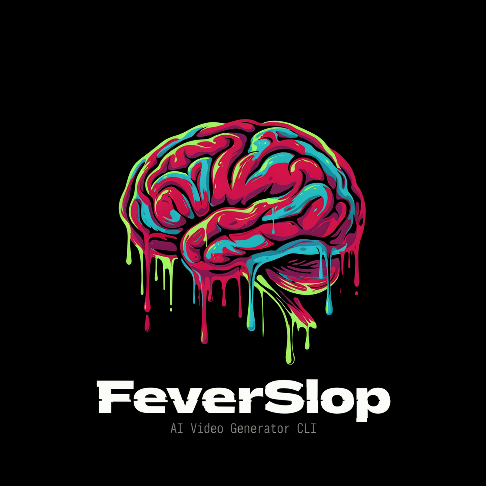

<div align="center">
  

# FeverSlop

**A local, inspectable CLI pipeline for turning music, lyrics, and visual direction into music videos.**

[](CHANGELOG.md)
[](https://www.python.org/)
[](LICENSE)
[](#command-line-interfaces)

[Quick start](#quick-start) · [How it works](#how-it-works) · [Documentation](#documentation) · [Changelog](CHANGELOG.md)
</div>

> [!WARNING]
> FeverSlop is an alpha project for experimenters and tinkerers, not a turnkey
> video product. A useful setup requires local models, ComfyUI workflows, an
> OpenAI-compatible LLM endpoint, and a willingness to inspect generated
> artifacts. CLI and workflow details may continue to change.

FeverSlop coordinates audio analysis, scene planning, prompt generation,
reference assets, ComfyUI workflow preparation, scene rendering, review, and
final audio/video assembly. Everything stays in ordinary project directories
so runs remain inspectable, resumable, and scriptable.

## Why FeverSlop?

| Capability | What it provides |
| --- | --- |
| Explainable runs | Preview each phase and scene as `RUN`, `REUSE`, `BLOCKED`, or `NOT_SELECTED`. |
| Human-owned corrections | Keep generated prompts and operator overrides separately in one canonical plan. |
| Scene-local recovery | Reuse valid H3 checkpoints, prepared workflows, references, and rendered clips independently. |
| Multiple renderers | Classic I2V, LTX MSR, LTX Ingredients, and MiniMax H3 modes share one project workflow. |
| Local-first operation | Use your own ComfyUI instance, workflows, models, media, and compatible LLM endpoint. |
| Compatibility | Existing project layouts, direct stage commands, and legacy plans remain readable. |

## Quick start

### 1. Install dependencies

FeverSlop requires Python 3.12 and [`uv`](https://docs.astral.sh/uv/):

```bash
uv sync
```

The default dependency source targets CUDA 13.0 on Linux and Windows. On
macOS, use the normal Python indexes instead:

```bash
uv sync --no-sources
```

See [Setup](documentation/setup.md) for ComfyUI, FFmpeg, model, workflow, LLM,
and platform requirements.

### 2. Create a project

```powershell
New-Item -ItemType Directory -Force ./projects/my-song/input
Copy-Item ./config.example.json ./projects/my-song/config.json
```

Place the audio file below `input/`, then set at least the project name and
audio path in `config.json`:

```json
{
  "project_name": "my-song",
  "input_audio": "input/my-song.mp3",
  "video_pipeline": "ltx_msr"
}
```

Input and project-media paths in `config.json` are resolved relative to the
config file. Workflow paths below `workflows` are repository-relative.

Recurring render choices can also be stored in `config.json`. For example,
MiniMax H3 R2V can use the bundled 8-step workflow with:

```json
"workflows": {
  "video": "workflows/video_minimax_h3_r2v_eb57_8s_v1.json",
  "reference_hero": "workflows/image_t2i_startframe_krea_v1.json",
  "reference_edit": "workflows/image_edit_flux2_klein_1ref_v1.json"
}
```

The normal dry-run detects resolution and workflow changes and explains the
downstream work. Explicit CLI workflow flags remain available as one-off
overrides. See [Project render settings](documentation/running.md#project-render-settings).

### 3. Preview, then run

The normal operator workflow always starts with a read-only plan:

```bash
uv run python main.py run ./projects/my-song --dry-run
uv run python main.py run ./projects/my-song --resume
```

On a brand-new project, the first resume pass creates the canonical render
plan. Run the pair once more so the now-known scenes can be planned and rendered:

```bash
uv run python main.py run ./projects/my-song --dry-run
uv run python main.py run ./projects/my-song --resume
```

For later runs, edits, or interruptions, the same pair selects only the stale
or missing work. The CLI explains why every stage and scene will run or be
reused.

## The normal operator loop

Inspect overall artifact freshness:

```bash
uv run python main.py status ./projects/my-song
```

Inspect generated, overridden, and effective values for one scene:

```bash
uv run python main.py plan show ./projects/my-song --scene 3
```

Human corrections belong only in:

```text
output/render/plans/base.json
```

Add `canonical.roles.<role>.override`, keep the generator-owned value intact,
then validate and rerender only the affected scene:

```bash
uv run python main.py plan validate ./projects/my-song
uv run python main.py run ./projects/my-song --dry-run --scenes 3
uv run python main.py run ./projects/my-song --resume --scenes 3
```

Do not edit `anchored.json`, `references.json`, `ingredients.json`, H3
checkpoints, manifests, or prepared workflows. They are derived inspection and
runtime caches. See [Human prompt correction workflows](documentation/running.md#human-prompt-correction-workflows)
for concrete H3, MSR, Ingredients, I2V, migration, and regeneration examples.

### Inspect H3 prompts while generation is running

Each completed MiniMax H3 scene is written immediately to:

```text
output/render/scenes/scene_NNNN/h3_prompt.json
```

The checkpoint contains the final prompt, judge result, attempts, and input
fingerprint. It is inspectable and resumable, but not editable; place a human
correction in the matching `h3.video.override` in `base.json`.

### Migrate edits from older projects

Preview migration without writing:

```bash
uv run python main.py plan-migrate ./projects/my-song
```

After resolving every reported conflict, apply the migration with backups:

```bash
uv run python main.py plan-migrate ./projects/my-song --apply
```

## Video pipeline modes

Select the default mode through `video_pipeline` in the project configuration:

| Value | Use case |
| --- | --- |
| `ltx_i2v` | Classic storyboard/start-frame image-to-video rendering. |
| `ltx_msr` | Actor/location reference-sheet driven LTX rendering. |
| `ltx_ingredients` | Per-scene Ingredients sheets with audio latent injection. |
| `minimax-h3-r2v` | Reference-to-video using subject, environment, style, motion, or camera assets. |
| `minimax-h3-i2v` | Image-to-video from the generated first frame. |
| `minimax-h3-t2v` | Text-to-video without image references. |
| `minimax-h3-fl2v` | First-and-last-frame guided video. |
| `minimax-h3-l2v` | Last-frame guided video. |

Backend-specific prompt, reference, audio, and timing structures remain
separate, while every mode resolves human overrides from the same canonical
plan. See [Pipelines](documentation/pipelines.md) and
[Render-plan artifacts](documentation/render-plan-artifacts.md).

## Command-line interfaces

### Primary: safe planning and resume

Use `main.py` for routine operation:

```bash
uv run python main.py run PROJECT --dry-run
uv run python main.py run PROJECT --resume
uv run python main.py status PROJECT
uv run python main.py plan show PROJECT --scene N
```

The complete command reference and exit-code contract are in
[Running FeverSlop](documentation/running.md).

When the package is installed, `feverslop` is the canonical command. The root
Python scripts remain supported compatibility entry points:

```bash
uv run feverslop --help
uv run feverslop run ./projects/my-song --dry-run
uv run feverslop status ./projects/my-song
uv run feverslop full-auto --idea "A neon chase" --style "dark synthwave"
```

### Advanced and compatibility interface

`run_pipeline.py` remains available for explicit stages, forced rerenders,
workflow experiments, and existing scripts. It is not the recommended default
resume interface:

```bash
uv run python run_pipeline.py ./projects/my-song \
  --stage prepare_workflows \
  --scenes 1,3,5

uv run python run_pipeline.py ./projects/my-song \
  --stage render_scenes \
  --scenes 1,3,5 \
  --no-skip-existing
```

Skip flags, renderer-specific tuning, FaceFix, SeedVR2, workflow overrides,
LoRA controls, rolling-frame profiles, and direct stage names are documented in
the [project workflow reference](documentation/project_workflow.md).

## Full-Auto

`full_auto.py` creates a project from an idea and music description, renders
ACE-Step audio through ComfyUI, writes `config.json`, and can continue into the
video pipeline:

```bash
uv run python full_auto.py \
  --idea "A neon chase through a rainy future city" \
  --style "dark synthwave with cinematic drums" \
  --project-name neon-wolves \
  --duration-seconds 120 \
  --width 1280 \
  --height 704 \
  --fps 24 \
  --run-video-pipeline \
  --video-pipeline ltx_msr
```

See [Full-Auto workflows](documentation/pipelines.md#full-auto-pipeline).

## Movie pipeline

Movie projects use their separate render-plan contract and entry point:

```bash
uv run python movie_pipeline.py ./projects/my-movie
```

Available workflows include MSR, I2V/Edit, Startframe Director, Ingredients,
and MiniMax H3. Movie plans deliberately do not use the music-video canonical
override contract. See the [Movie pipeline](documentation/pipelines.md#movie-pipeline).

## How it works

```text
audio + lyrics + config
          │
          ▼
  analysis and scene planning
          │
          ▼
  canonical base.json
  generated + human override
          │
          ▼
  effective backend projection
          │
          ▼
  references and prepared workflows
          │
          ▼
  scene clips → review → final mux
```

The global plan revision is diagnostic. Actual reuse is decided through
scene-local prompt/workflow and reference fingerprints, plus hashes of concrete
assets and workflow templates. An edit therefore invalidates only the affected
scenes when the dependency evidence is sufficient.

## Project layout

```text
projects/my-song/
├── config.json
├── input/
│   └── my-song.mp3
└── output/
    ├── timeline/
    ├── prompts/
    ├── references/
    └── render/
        ├── plans/
        │   └── base.json
        └── scenes/
            └── scene_0001/
                ├── h3_prompt.json
                ├── manifest.json
                ├── workflow.json
                └── final.mp4
```

## Requirements

Most useful runs require:

- Python 3.12 and `uv`;
- FFmpeg in `PATH`;
- ComfyUI reachable through `app_config.json`;
- the custom nodes, models, and API workflows for the selected renderer;
- an OpenAI-compatible LLM endpoint;
- ACE-Step nodes and `workflows/audio_song_v2.json` for Full-Auto audio.

## Documentation

Start here:

- [Documentation index](documentation/README.md) — complete user-facing map.
- [Setup](documentation/setup.md) — dependencies, ComfyUI, models, LLM, and local configuration.
- [Running](documentation/running.md) — normal CLI, status, correction, migration, and recovery.
- [Project workflow](documentation/project_workflow.md) — advanced stages, flags, rendering controls, and troubleshooting.
- [Render-plan artifacts](documentation/render-plan-artifacts.md) — canonical schema, ownership, projections, and invalidation.
- [Editing project JSON](documentation/project-json-editing.md) — what may and may not be edited.
- [Pipelines](documentation/pipelines.md) — Classic, MSR, Ingredients, MiniMax H3, Full-Auto, and Movie workflows.
- [Projects](documentation/projects.md) — directory layout, configuration, and artifacts.
- [Examples](documentation/examples.md) — worked standard and Full-Auto commands.

Project and contributor references:

- [Architecture compatibility](documentation/architecture_compatibility.md)
- [Prompt architecture](documentation/prompt-architecture.md)
- [Global assets](documentation/global-assets.md)
- [App configuration](documentation/app_config.md)
- [Workflow model requirements](documentation/workflow-models.md)
- [Contributing](CONTRIBUTING.md)
- [Security policy](SECURITY.md)
- [Changelog](CHANGELOG.md)

## Development

Python packages live under `src/feverslop`; tests live under `tests`.
Composition code stays separate from adapters such as
`feverslop.adapters.comfyui_video_backend`; see the architecture documentation
for compatibility boundaries. The legacy
`feverslop.composition.generate_render_plan` import remains available for
existing integrations.

```bash
ruff check .
uv run python -m unittest discover -s tests
```

Install the checked-in pre-commit hooks with:

```bash
uvx pre-commit install
```

FeverSlop is licensed under the [MIT License](LICENSE).
